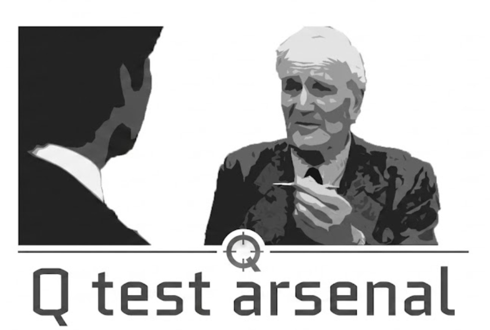

<p align="center">
  
</p>

# 🚀 Q - Test Arsenal

**Q - Test Arsenal** è un framework autonomo di testing automatizzato E2E visivo per applicazioni mobile (**Flutter & Native Android**), basato su modelli Vision-Language (**VLM**) eseguiti completamente in locale.

Il sistema esegue un grounding visivo a due livelli (**Coarse + Fine Bounding Box Zoom Crop**) ed interagisce direttamente con il dispositivo Android via ADB, senza dipendere da servizi cloud esterni o ID di elemento hardcodati nel codice.

---

### 🕵️‍♂️ Perché "Q"? — Un tributo a Ian Fleming

Nei romanzi e nei film ideati da **Ian Fleming**, **Q** è l'iconico *Quartermaster* del laboratorio segreto: la mente geniale che non scende sul campo di battaglia al posto dell'agente 007, ma lavora nell'ombra per forgiargli i gadget ed i dispositivi straordinari capaci di salvarlo nelle missioni più impossibili.

**Q - Test Arsenal** nasce con lo stesso spirito artigianale e romantico: non sostituisce il lavoro dello sviluppatore, ma presidia silenziosamente ogni angolo dell'interfaccia mobile prima del lancio, testa visivamente ogni scenario e ti consegna l'arsenale perfetto prima che il tuo codice affronti la produzione.

**Veloce, essenziale, letale contro i bug.**

---

## 📋 Indice
1. [Componenti di Sistema Richiesti](#-componenti-di-sistema-richiesti)
2. [Modelli VLM Consigliati](#-modelli-vlm-consigliati)
3. [Setup dell'Ambiente e Dipendenze](#-setup-dellambiente-e-dipendenze)
4. [Validazione Automatica dell'Ambiente](#-validazione-automatica-dellambiente)
5. [Dove Impostare la Configurazione](#-dove-impostare-la-configurazione)
6. [Dove Inserire e Creare gli Scenari di Test](#-dove-inserire-e-creare-gli-scenari-di-test)
7. [Suite Manifest & Gestione Errori](#-suite-manifest--gestione-errori-continue_on_failure)
8. [Esecuzione dei Test (CLI `q-test`)](#-esecuzione-dei-test-cli-q-test)
9. [Telemetria, Root Cause Debugging e Report HTML](#-telemetria-root-cause-debugging-e-report-html)
10. [Riconoscimenti e Crediti](#-riconoscimenti-e-crediti)
11. [Licenza](#-licenza)

---

## 🛠️ Componenti di Sistema Richiesti

Prima di avviare **Q - Test Arsenal**, assicurati che siano installati i seguenti componenti di sistema sul tuo computer:

### 1. Android Debug Bridge (ADB)
Richiesto per comunicare con dispositivi fisici o emulatori Android.

* **macOS**:
  ```bash
  brew install android-platform-tools
  ```
* **Linux (Ubuntu/Debian)**:
  ```bash
  sudo apt update && sudo apt install -y android-tools-adb
  ```
* **Windows**:
  ```powershell
  winget install Google.PlatformTools
  # Oppure tramite Scoop:
  scoop install adb
  ```

### 2. llama.cpp (`llama-server`)
Richiesto per eseguire l'inferenza locale multimodale dei modelli VLM con accelerazione GPU.

* **macOS (con accelerazione Metal GPU)**:
  ```bash
  brew install llama.cpp
  ```
* **Linux / Windows**:
  Scarica l'eseguibile precompilato `llama-server` dalle [Release Ufficiali di llama.cpp su GitHub](https://github.com/ggerganov/llama.cpp/releases) ed inseriscilo nel `PATH` di sistema o specifica il percorso completo nel file di configurazione.

---

## 🧠 Modelli VLM Consigliati

Per garantire la massima precisione nell'individuazione visiva dei bottoni e campi di testo (Grounding), si consiglia l'uso dei seguenti modelli multimodali in formato GGUF:

| Tipo | Modello Consigliato | Descrizione |
| :--- | :--- | :--- |
| **Modello VLM (GGUF)** | `UI-TARS-7B-DPO-Q4_K_M.gguf` | Modello specializzato per il grounding di interfacce GUI e mobile. |
| **Proiettore Multimodale (mmproj)** | `mmproj-UI-TARS-7B-f16.gguf` | Proiettore di visione associato al modello UI-TARS. |
| **Alternativa VLM** | `Qwen2-VL-7B-Instruct-Q4_K_M.gguf` | Modello generico per Vision-Language di alta qualità. |

### 📁 Dove Posizionare i Modelli
Si consiglia di creare una cartella dedicata nella directory home utente, ad esempio:
* **macOS / Linux**: `~/.modelli_llm/` (es: `/Users/nomeutente/.modelli_llm/UI-TARS-7B-DPO-Q4_K_M.gguf`)
* **Windows**: `C:\modelli_llm\`

---

## 📦 Setup dell'Ambiente e Dipendenze

### 1. Creazione del Virtual Environment
Crea ed attiva un ambiente virtuale Python (versione Python $\ge 3.11$):

```bash
# Su macOS / Linux:
python3 -m venv .venv
source .venv/bin/activate

# Su Windows (PowerShell):
python -m venv .venv
.\.venv\Scripts\Activate.ps1
```

### 2. Installazione del Pacchetto e Dipendenze Python
Installa le dipendenze Python ed il pacchetto in modalità editable:

```bash
pip install -e .
```
*(Oppure installa direttamente le dipendenze via `pip install -r requirements.txt`).*

---

## 🔍 Validazione Automatica dell'Ambiente

Questo progetto include uno script di diagnostica completo ([`validate_setup.py`](validate_setup.py)) che controlla se tutti i componenti di sistema, l'ambiente Python, l'eseguibile `llama-server`, la connessione ADB ed i file `.gguf` dei modelli sono pronti all'uso:

```bash
python validate_setup.py
```

### Controlli effettuati da `validate_setup.py`:
1. **Dipendenze Python**: `PyYAML`, `Pillow`, `ImageHash`, `Rich`, `HTTPX`.
2. **Moduli Interni Framework**: `q_test_arsenal.core`, `runner`, `cli`.
3. **ADB & Dispositivi**: Presenza del comando `adb` e presenza di uno smartphone/emulatore Android connesso.
4. **VLM Engine**: Presenza dell'eseguibile `llama-server` e relativo stato health.
5. **Modelli VLM**: Verifica esistenza su disco dei file `.gguf` del modello e dell'mmproj configurati.
6. **Scenari**: Presenza di file `.yaml` validi nella cartella `scenarios/`.

---

## ⚙️ Dove Impostare la Configurazione

La configurazione globale di **Q - Test Arsenal** si trova in:
👉 **[`q_test_arsenal/config/default_config.yaml`](q_test_arsenal/config/default_config.yaml)**

### Parametri Principali

```yaml
server:
  host: "127.0.0.1"
  port: 8080
  model_path: "~/.modelli_llm/UI-TARS-7B-DPO-Q4_K_M.gguf"       # Percorso al modello GGUF
  mmproj_path: "~/.modelli_llm/mmproj-UI-TARS-7B-f16.gguf"      # Percorso al proiettore mmproj
  binary: "llama-server"                                        # Nome o percorso all'eseguibile
  context_size: 4096
  gpu_layers: 99                                                # Layer da caricare su GPU (-ngl 99)
  threads: 8
  flash_attn: true                                              # Flash Attention (-fa on)
  auto_start: true                                              # Avvia il server automaticamente se non attivo

device:
  serial: ""                                                    # Serial ADB (se vuoto o non connesso, si avvia il menu interattivo)
  show_touches: true                                            # Attiva l'indicatore bianco dei tocchi a schermo

runner:
  default_max_retries: 3
  debug_screenshots_dir: "reports/screenshots"
  reports_dir: "reports"
```

### 📱 Selezione Interattiva Dispositivo ADB & Autosalvataggio Preferenze
Quando il framework viene avviato:
1. Se il parametro `device.serial` nel file di configurazione è vuoto (`""`) oppure il dispositivo salvato **non è attualmente connesso** via USB/ADB:
   - Il sistema scansiona i dispositivi Android ed emulatori collegati.
   - Viene mostrato un **menu di selezione interattivo** da terminale.
2. Una volta selezionato il dispositivo desiderato (es. `R52M904J1QM`), il suo serial viene **salvato automaticamente nelle preferenze** ([`q_test_arsenal/config/default_config.yaml`](q_test_arsenal/config/default_config.yaml)).
3. Per le esecuzioni successive, il sistema utilizzerà direttamente il dispositivo salvato senza più richiedere l'intervento dell'utente!

---

## 📂 Dove Inserire e Creare gli Scenari di Test

Tutti gli scenari di test in formato YAML vanno inseriti nella cartella:
👉 **[`scenarios/`](scenarios/)** (es: `scenarios/login_flow.yaml`)

### Struttura di uno Scenario YAML

```yaml
name: "Login Flow Scenario - Production Suite"
description: "Scenario di test automatico per la configurazione dell'URL API ed il login"

steps:
  - type: "action_until"
    target: "Icona dell'ingranaggio (Impostazioni) in alto a destra dello schermo"
    until_condition: "È visibile a schermo un dialogo con titolo 'Insert API URL'."
    max_retries: 3

  - type: "type_text"
    target: "Campo di testo per l'URL API"
    value: "api.example.com"

  - type: "type_text"
    target: "Campo di testo per lo Shop Code"
    value: "dev2"

  - type: "action"
    target: "Pulsante 'Save' per salvare le impostazioni"

  - type: "type_text"
    target: "Area di testo per lo Username o Email"
    value: "${USER_EMAIL}"                                      # Supporta variabili d'ambiente

  - type: "type_text"
    target: "Area di testo per la Password"
    value: "${USER_PASSWORD}"

  - type: "wait"
    seconds: 2                                                  # Pausa di attesa in secondi (per completamento animazioni)

  - type: "action"
    target: "Pulsante azzurro con scritto 'Login'"

assertion:
  wait_seconds: 2                                               # Pausa prima di catturare lo screenshot finale dell'asserzione
  description: "La schermata di Login è scomparsa ed è visibile la schermata di caricamento/sincronizzazione o il carrello principale."
```

### Tipi di Step Disponibili:
* `action`: Grounding VLM + Tap singolo sull'elemento specificato in `target`.
* `type_text`: Grounding VLM + Selezione + Pulizia automatica + Inserimento del testo specificato in `value`.
* `action_until`: Ripete il tap fino a quando la condizione `until_condition` non risulta vera.
* `long_press_until`: Esegue la pressione prolungata (Long Press) fino al soddisfacimento di `until_condition`.
* `wait`: Pausa di attesa in secondi (`seconds: N`) per consentire il completamento di transizioni UI o animazioni.
* `include_scenario`: Include ed esegue i passi di un altro scenario YAML (`scenario: "scenarios/login_flow.yaml"`).

---

## 🏆 Suite Manifest & Gestione Errori (`continue_on_failure`)

### 1. Scenari che contengono altri Scenari
Puoi creare un file YAML di Suite (es: `scenarios/master_suite.yaml`) per ordinare ed eseguire in sequenza precisa varie suite di test dell'applicazione, specificando per ciascuna le preferenze delle macro ed il comportamento in caso di errore:

```yaml
name: "E2E Complete Test Suite"
description: "Suite principale che ordina ed esegue in sequenza la configurazione, il login ed il checkout"
continue_on_failure: true                        # Prosegue con i test successivi anche se uno scenario fallisce

scenarios:
  - file: "scenarios/login_flow.yaml"
    use_macro: true
    continue_on_failure: false                    # Se il login fallisce, ferma l'esecuzione della suite

  - file: "scenarios/checkout_flow.yaml"
    use_macro: false
```

Per eseguire l'intera suite ordinata dal manifest:
```bash
q-test scenarios/master_suite.yaml
```

### 2. Controllo del Flusso di Errore (`continue_on_failure`)
Puoi configurare se arrestare l'esecuzione oppure continuare anche se uno step o un'asserzione visiva fallisce:
* **Nei Manifest o Scenari YAML**: Impostando `continue_on_failure: true` nel file YAML.
* **Da Comando CLI**: Aggiungendo la flag `--continue-on-failure`:
  ```bash
  q-test scenarios/login_flow.yaml --continue-on-failure
  ```

---

## 🏃 Esecuzione dei Test (CLI `q-test`)

Il framework fornisce il pratico comando CLI **`q-test`** (ed in alternativa `python -m q_test_arsenal.cli.main`):

### 1. Esecuzione Batch (Tutti gli scenari in `scenarios/`)
```bash
q-test
```

### 2. Esecuzione di uno Scenario Specifico
```bash
q-test scenarios/login_flow.yaml
```

### 3. ⚡ Registrazione ed Esecuzione Ibrida con Macro (`--save-macro` e `--use-macro`)
Per registrare i tocchi e velocizzare l'esecuzione saltando le chiamate VLM quando la schermata è invariata:

* **Registrazione ed esportazione Macro JSON**:
  ```bash
  q-test scenarios/login_flow.yaml --save-macro
  ```
  Salva la sequenza delle azioni, coordinate percentuali ed hash visivi in `scenarios/macros/login_flow.macro.json`.

* **Esecuzione Ibrida (Fast-Path + Fallback VLM)**:
  ```bash
  q-test scenarios/login_flow.yaml --use-macro
  ```
  Confronta lo schermo attuale con l'hash salvato: se la schermata coincide ($\ge 85\%$), esegue il tocco in **~100ms** senza impegnare il VLM; se lo schermo differisce, passa automaticamente la palla all'IA visiva (**VLM 2-Pass Zoom Crop**).

---

## 📊 Telemetria, Root Cause Debugging e Report HTML

Dopo l'esecuzione di un test, il framework genera automaticamente:

1. **Dashboard Master & Report Singoli Interattivi**:
   * Salvati nella cartella `reports/` (es: `reports/login_flow_report.html` e `reports/master_report.html`).
   * **Navigazione 1-Click**: La Master Dashboard contiene i pulsanti diretti (`📄 Apri Report Dettagliato →`) verso ciascun sotto-report, e ogni report singolo include un link di ritorno (`← Torna alla Master Dashboard`).
   * **Screenshot dell'Asserzione Visiva Finale**: Evidenzia l'immagine ed il testo dell'esito dell'asserzione finale visiva (`final_assertion_<scenario>.png`).

2. **Telemetria delle Latenze & KPI Performance**:
   * Per ogni step vengono misurati con precisione al millisecondo: `📷 Screencap`, `🧠 VLM Pass 1 (Coarse)`, `🔎 VLM Pass 2 (Zoom Crop Fine)`, `⚡ ADB Input`.
   * Le KPI medie di latenza VLM ed ADB vengono calcolate e sintetizzate nelle card in cima ai report HTML.

3. **🔍 Root Cause Debug Analysis per Step Falliti**:
   * Se uno step o tocco fallisce, il report HTML genera una card speciale di debug in stile dark-magenta contenente la risposta JSON raw del VLM, le coordinate tentate, le note di retry ed il ritaglio zoom sull'area bersaglio.

4. **File di Log Dettagliati**:
   * Salvati in `logs/run_YYYYMMDD_HHMMSS.log` (automaticamente ignorati da git), contenenti tutte le chiamate ADB, risposte JSON dei modelli e stack trace per il debugging.

---

## 🙏 Riconoscimenti e Crediti

Questo progetto nasce ed è stato sviluppato come evoluzione ed estensione di **[MobileRun (droidrun)](https://github.com/droidrun/mobilerun)**, creato da **[Niels Schmidt](https://github.com/niels-schmidt)** ([DroidRun](https://droidrun.ai/)).

### 💡 Il contributo di `mobilerun` a questo progetto:
* **Infrastruttura Agenti & Tooling Mobile**: `mobilerun` fornisce l'architettura di base per l'interazione con i dispositivi (ADB/iOS), il supporto multimodale per i provider LLM/VLM ed il sistema di macro/telemetria.
* **Q - Test Arsenal**: Sviluppato in autonomia da **Emanuele Coltro**, estende l'infrastruttura originale trasformandola in un framework autonomo di testing E2E visivo basato su scenari YAML, motore di grounding a due livelli (**2-Pass Zoom Crop**), report HTML interattivi con telemetria avanzata, Fast-Path Macro ed il comando CLI `q-test`.

Un sentito ringraziamento a Niels Schmidt e al team di DroidRun per lo straordinario lavoro svolto nel progetto originale.

---

## 📄 Licenza

Distribuito sotto licenza **MIT License**. Per maggiori dettagli, consulta il file [LICENSE](LICENSE).
